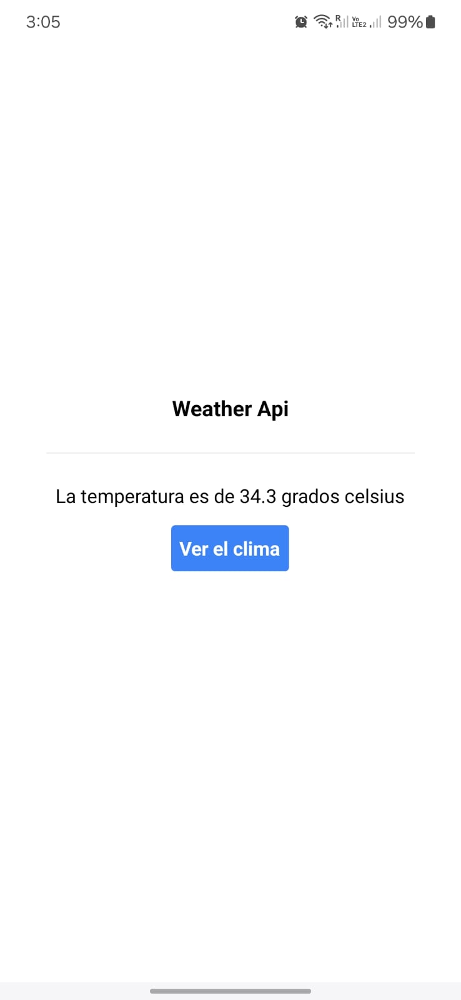

# README

Este README describe el proyecto, asi como la puesta en marcha de la aplicación.

# Repositorio de evaluación

Este repositorio fue hecho con la finalidad de ayudar en el proceso de evaluación para la vacante de desarrollador Frontend.

### Principales Librerias y Framewoks Usados.

**React Native**: Por requerimientos de la evaluación, el proyecto esta desarrollado en base a este framework.

**Typescript**: Nos brinda a nuestro proyecto un mejor orden en cuestion de tipado y detectar rapidamente errores en nuestro editor.

**Tailwind**: Nos ofrece un repositorio repleto de clases CSS, que por consiguiente nos permite diseñar componentes personalizados. Por estas ventajas descritas es que se incluyó en el proyecto.

**Prettier**: Lo que ofrece esta herramienta es tomar nuestro codigo y re-formatearlo en base a las configuraciones definitas en el archivo .prettierrc.js

### Requisitos

**Nodejs**: Se probó con la versión 23.5.0, sino cuenta con alguno, se sugiere usar NVM para usar multiples versiones.

**NPM**: Se probó con la versión 10.9.2

**Android Studio**: Si quieres usar el emulador de Android.

**Xcode**: Si quieres usar el emulador de iOS.

### Instalación

1.- Clone el repositorio

```
git clone https://github.com/kevbrygil/WeatherApp.git
```

2.- Dirijase a la raiz del proyecto e instale la paqueria

```
cd WeatherApp/
npm install
```

3.- Ejecute la app

```
npm run start
```

### Explicación de la interfaz

#### Pantalla inicio

La app solo cuenta con esta pantalla, cabe destacar si requieres ver el clima en tu localidad, debes aceptar el acceso de geolocalización, sino la app tomara una latitud y longitud por defecto(latitude=20.73918000 y longitude=-89.28490000).
Al momento de darle clic a Ver el clima, la app consumira la api del clima y te dara el clima a una escala de 2 metros a la redonda.

